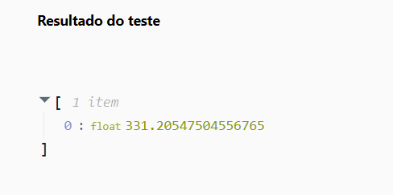

# Trabalhando com Machine Learning na Prática no Azure ML

## Guia de Utilização do Azure Machine Learning

Este guia fornece instruções sobre como configurar e usar o Azure Machine Learning para criar, treinar e testar modelos de aprendizado de máquina.

### Passo 1: Criar Recurso do Azure Machine Learning
1. Acesse o portal do Azure e clique em "Criar recurso".
2. Pesquise por "Azure Machine Learning" no marketplace e crie o recurso.

### Passo 2: Configurar o Recurso do Azure Machine Learning
1. Na aba de Noções básicas, preencha as informações de assinatura e grupo de recursos.
2. Configure os detalhes da área de trabalho e crie o recurso.

### Passo 3: Criar o Modelo
1. Acesse o estúdio do Azure Machine Learning.
2. Crie um novo trabalho de ML automatizado, configurando os detalhes básicos e selecionando os dados.
3. Escolha a tarefa de regressão, selecione os dados e configure as opções de validação e computação.
4. Envie o trabalho de treinamento e crie o modelo.

### Passo 4: Métricas do Modelo
1. Acesse as métricas do modelo treinado na página do modelo ou na aba "Tarefas (jobs)".

### Passo 5: Teste do Modelo
1. Implante o modelo na aba "Pontos de extremidade" da página do modelo.
2. Caso o botão de implantação não funcione, crie um ponto de extremidade manualmente.
3. Acesse a aba "Testar" do ponto de extremidade e envie uma solicitação de teste com os dados JSON.

<code>
{
    "input_data": {
      "data": [
         {
           "day": 21,
           "mnth": 2,   
           "year": 2026,
           "season": 2,
           "holiday": 0,
           "weekday": 1,
           "workingday": 1,
           "weathersit": 2, 
           "temp": 0.3, 
           "atemp": 0.3,
           "hum": 0.3,
           "windspeed": 0.3 
         }
       ]
    }
  }
<code>

resultado:

float331.20547504556765

Entre em contato:

